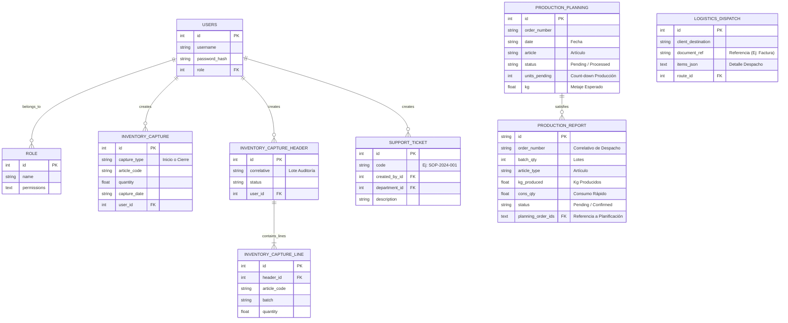
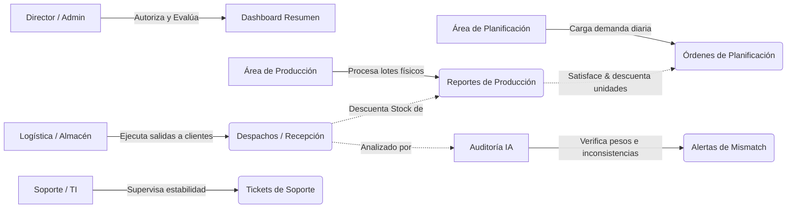
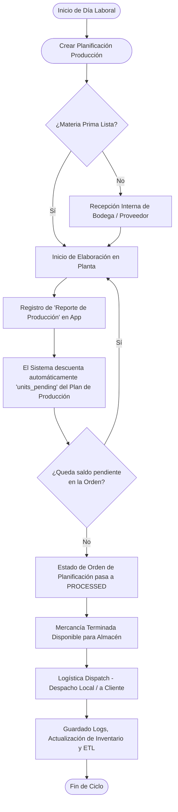

# Documentación Técnica - Sistema de Reporte de Producción

Esta documentación detalla la arquitectura, procesos y flujos, diseño de base de datos (ERD) y los puntos de acceso del sistema en su estado actual de producción.

## 1. Información General y Accesos

- **URL de Acceso (Dashboard/App):** `http://192.168.1.73:8000`
- **Dirección IP del Servidor:** `192.168.1.73`
- **Puerto Explotado:** `8000`
- **Base de Datos:** SQLite (`production.db`)
- **Tecnología Base:** Backend en FastAPI (Python 3.11+), y Frontend usando HTML5/CSS3/Vanilla JS (Plantillas Jinja2) + Despliegue con Docker.

### 1.1 Credenciales y Accesos al Sistema
Las credenciales maestras por defecto en el sistema son:
- **Usuario Admin:** `admin`
- **Contraseña Admin:** `admin`

*(Nota: En producción se recomienda encarecidamente cambiar estos datos y generar usuarios según la jerarquía del rol).*

### 1.2 Jerarquía de Roles de Usuario
- **1** - Visualización (Only KPIs)
- **2** - Producción (Creación de Reportes de Producción)
- **3** - Planificación (Creación de Órdenes de Producción)
- **4** - Admin (Acceso Total + Mantenimiento)
- **5** - Almacén
- **6** - Inventario (Capturas de Stock)
- **7** - Patrimonial
- **8** - Director

---

## 2. Diagrama de Base de Datos y Entidad-Relación (ERD)

A continuación se presente el modelo simplificado de las relaciones principales que rigen la lógica de negocio (Planificación, Producción, Inventario y Logística).

---

## 3. Diagramas de Flujo y Procesos

### 3.1 Flujo General y Ecosistema de Áreas
Cómo interactúan los diferentes departamentos y la correlación de datos de inicio a fin.

### 3.2 Diagrama de Proceso de Producción
Un esquema detallado paso a paso de lo que ocurre cuando se inicia el día laboral.

## 4. Estructura y Componentes Clave

1. **Servicios de Automatización Back-End (Cron / Scheduler):**
   - El sistema tiene `scheduler` de alertas automáticas corriendo en Background para detectar "Mismatch" o inconsistencias (Archivos: `app/services/automation_scheduler.py` y `mismatch_scheduler.py`).

2. **Copias de Seguridad Replicadas (Profit Plus):**
   - Existen modelos tipo ETL que clonan datos transitorios (`ProfitArticulo`, `ProfitStockAlmacen`) de un ERP secundario o antiguo para conciliar Data.

3. **Asistente de Auditoría (IA Integrada):**
   - Existen registros de `AuditLog` y `SystemInsight` donde las métricas recolectan despachos vs unidades producidas. Si la AI detecta merma sospechosa o desviaciones en peso (por ejemplo, empacado vs lo reportado), crea una bandera en tiempo real en la pestaña del Asistente (`/assistant`).

---
**Nota final para Despliegues / Updates:** Cualquier actualización debe ser manejada usando el clúster de Docker apuntando al repositorio central o mediante archivo Compose usando comando estándar `docker compose up -d --build`.
